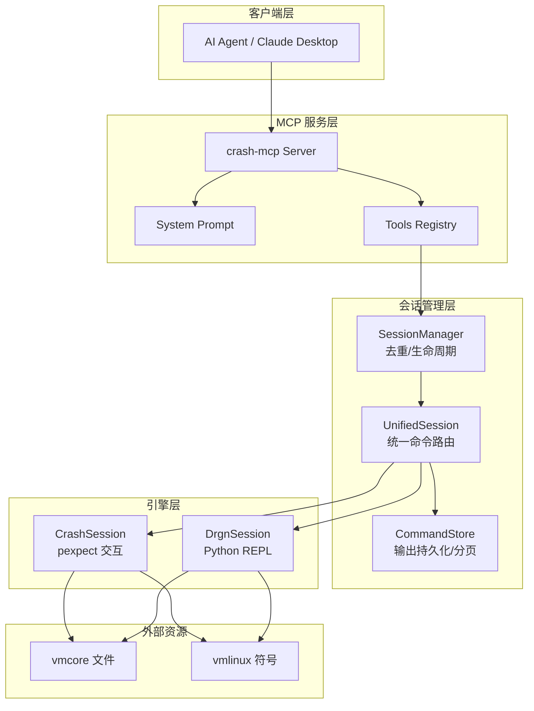
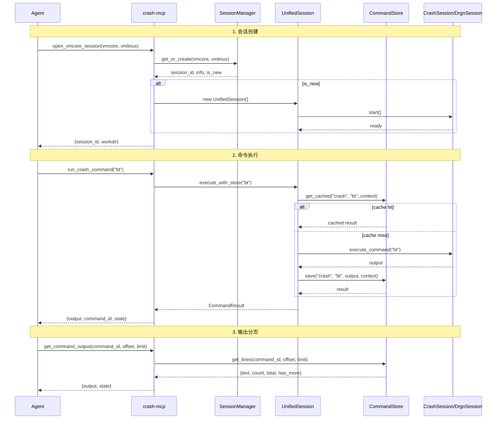

# Crash-MCP 架构设计

## 1. 系统概述

crash-mcp 是基于 MCP (Model Context Protocol) 的服务器，为 AI Agent 提供系统崩溃转储 (Crash Dump) 分析能力。集成 Linux `crash` 实用程序和 `drgn` 可编程调试器，提供统一分析接口。



## 2. 核心模块

### 2.1 服务器入口 (server.py)

- **FastMCP 框架**: 使用 `mcp.server.fastmcp.FastMCP` 构建
- **传输模式**: Stdio（默认）/ SSE（HTTP）
- **工具注册**: 通过 `register_all_tools()` 注册所有工具
- **System Prompt**: 自动注入系统提示词到客户端

### 2.2 会话管理层

| 模块 | 路径 | 职责 |
|------|------|------|
| **SessionManager** | `common/session_manager.py` | 会话生命周期管理，vmcore MD5 去重 |
| **UnifiedSession** | `common/unified_session.py` | 统一 crash/drgn 命令路由，上下文追踪 |
| **CommandStore** | `common/command_store.py` | 命令输出持久化，分页查询，正则搜索 |
| **context.py** | `context.py` | 全局状态：会话字典、last_session_id、cleanup |

### 2.3 引擎会话

| 引擎 | 路径 | 特性 |
|------|------|------|
| **CrashSession** | `crash/session.py` | pexpect 交互，自动架构检测，扩展加载，PyKdump 支持 |
| **DrgnSession** | `drgn/session.py` | Python REPL 交互，base64 脚本注入，drgn-tools 集成 |
| **BaseSession** | `common/session.py` | 抽象基类，SSH 远程支持，智能截断 |

### 2.4 工具层

| 模块 | 路径 | 工具 |
|------|------|------|
| **session_mgmt** | `tools/session_mgmt.py` | 会话生命周期，命令执行 |
| **output_tools** | `tools/output_tools.py` | 输出分页，搜索 |
| **analysis_scripts** | `tools/analysis_scripts.py` | 脚本管理与执行（条件注册） |
| **get_info** | `tools/get_info.py` | 自动化诊断报告（条件注册） |
| **utils** | `tools/utils.py` | `json_response()`, `get_session()` 共享函数 |

## 3. MCP 工具集

### 3.1 会话工具 (session_mgmt)

| 工具 | 用途 | 参数 |
|------|------|------|
| `open_vmcore_session` | 启动分析会话 | vmcore_path, vmlinux_path, ssh_host?, ssh_user?, crash_args? |
| `close_vmcore_session` | 终止会话 | session_id? (默认 last_session) |
| `run_crash_command` | 执行 crash 命令（支持 PyKdump） | command, session_id?, force_execute? |
| `run_drgn_command` | 执行 drgn Python 代码 | command, session_id?, force_execute? |

> **Note**: `list_crash_dumps` 和 `run_pykdump_command` 存在但未公开暴露。

### 3.2 输出工具 (output_tools)

| 工具 | 用途 | 参数 |
|------|------|------|
| `get_command_output` | 获取截断输出的剩余行 | command_id, offset?, limit? (max 500) |
| `search_command_output` | 在命令输出中正则搜索 | command_id, query, context_lines? |

### 3.3 扩展工具 (条件注册)

| 工具 | 用途 | 依赖配置 |
|------|------|----------|
| `run_analysis_script` | 运行预定义分析脚本 | `DRGN_SCRIPTS_PATH` |
| `list_analysis_scripts` | 列出可用分析脚本 | `DRGN_SCRIPTS_PATH` |
| `get_crash_info` | 获取崩溃诊断报告 | `GET_DUMPINFO_SCRIPT` |

### 3.4 响应格式

所有工具返回 JSON 格式：

```json
{
  "status": "success" | "error",
  "result": { ... },     // 成功时
  "error": "message"     // 失败时
}
```

## 4. 数据流



## 5. 目录结构

```
crash-mcp/
├── src/crash_mcp/
│   ├── server.py            # MCP 服务器入口
│   ├── config.py            # 配置管理
│   ├── context.py           # 全局状态
│   ├── prompts.py           # System Prompt 加载
│   ├── tools/
│   │   ├── session_mgmt.py  # 会话管理工具
│   │   ├── output_tools.py  # 输出工具
│   │   ├── analysis_scripts.py # 脚本工具
│   │   ├── get_info.py      # 诊断报告工具
│   │   └── utils.py         # 工具共享函数
│   ├── common/
│   │   ├── base_session.py  # BaseSession 抽象类
│   │   ├── session_manager.py # 会话生命周期/去重
│   │   ├── unified_session.py # 统一命令路由
│   │   ├── command_store.py   # 输出持久化
│   │   ├── vmcore_discovery.py # vmcore 发现
│   │   └── arch_detect.py    # 架构检测
│   ├── crash/
│   │   └── session.py       # CrashSession 实现
│   ├── drgn/
│   │   └── session.py       # DrgnSession 实现
│   ├── builder/             # crash 编译器
│   └── resource/            # 资源加载与管理
├── bin/                     # 编译的 crash 二进制
├── lib/crash/extensions/    # crash 扩展
├── docs/                    # 文档
└── tests/                   # 测试
```

## 6. 配置项

| 环境变量 | 默认值 | 说明 |
|----------|--------|------|
| `CRASH_SEARCH_PATH` | `/var/crash` | vmcore 搜索路径（list_crash_dumps 使用） |
| `CRASH_EXTENSION_LOAD` | `true` | 是否自动加载扩展（-x 参数） |
| `CRASH_EXTENSION_PATH` | `""` | 扩展搜索路径（冒号分隔） |
| `CRASH_MCP_TRUNCATE_LINES` | `20` | 输出截断行数 |
| `CRASH_MCP_WORKDIR` | `/tmp/crash-mcp-sessions` | 会话工作目录 |
| `CRASH_MCP_CACHE` | `true` | 启用命令缓存 |
| `LOG_LEVEL` | `INFO` | 日志级别 |
| `SUPPRESS_MCP_WARNINGS` | `true` | 抑制 MCP 警告 |
| `GET_DUMPINFO_SCRIPT` | `""` | 自动化诊断脚本模板 |
| `DRGN_SCRIPTS_PATH` | `""` | drgn 脚本搜索路径（冒号分隔） |

## 7. 技术依赖

```toml
dependencies = [
    "mcp",            # MCP 协议框架
    "python-dotenv",  # 环境变量
    "pexpect",        # 交互式进程控制
    "drgn",           # drgn 调试器
    "drgn-tools",     # drgn 工具集
    "click",          # CLI 框架
    "pyyaml",         # YAML 解析
]
```

## 8. 关键设计

### 8.1 会话去重

SessionManager 通过 vmcore 文件的 MD5（前 64MB）实现去重：
- 同一 vmcore 自动复用已有会话
- 引用计数管理共享会话生命周期

### 8.2 命令缓存

CommandStore 实现上下文感知的命令缓存：
- `command_id` 格式: `engine:cmd_prefix:hash[@context_hash]`
- 上下文相关命令（bt, task 等）包含 pid/cpu 上下文
- `force_execute=true` 可强制重新执行

### 8.3 输出管理

- 自动截断长输出（默认 20 行）
- 完整输出持久化到 workdir
- 分页查询和正则搜索支持

### 8.4 多引擎支持

UnifiedSession 自动路由命令：
- `crash:cmd` → CrashSession
- `drgn:code` → DrgnSession
- `pykdump:code` → CrashSession.run_pykdump
- 默认无前缀 → crash 引擎

### 8.5 条件功能注册

为了保持接口简洁，部分高级功能根据配置条件注册：
- `run_analysis_script` / `list_analysis_scripts`: 仅当配置 `DRGN_SCRIPTS_PATH` 时注册
- `get_crash_info`: 仅当配置 `GET_DUMPINFO_SCRIPT` 时注册
