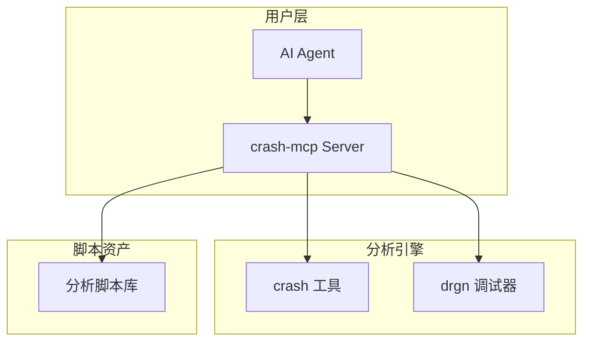

# Crash-MCP 架构设计

## 1. 系统概述


```mermaid
graph TB
    subgraph "用户层"
        AI[AI Agent]
        MCP[crash-mcp Server]
    end
    
    subgraph "分析引擎"
        CRASH[crash 工具]
        DRGN[drgn 调试器]
    end
    
    subgraph "脚本资产"
        SCRIPTS[分析脚本库]
    end
    
    AI --> MCP
    MCP --> CRASH
    MCP --> DRGN
    MCP --> SCRIPTS
```

## 2. 核心模块

### 2.1 会话管理 (Session Management)

- **统一会话**: 同时支持 `crash` 和 `drgn` 引擎
- **远程分析**: 通过 SSH 连接远程主机
- **多会话**: 支持同时分析多个 vmcore

### 2.2 脚本工具 (Script Utilities)

提供预置的 drgn 分析脚本，覆盖常见分析场景：

| 类别 | 脚本 |
|------|------|
| Lock | `lock_spinlock.py`, `lock_rwsem.py`, `lock_mutex.py` |
| Analysis | `panic_info.py`, `stack_trace.py`, `task_list.py`, `hung_task.py` |
| Memory | `memory.py`, `slab_dump.py` |
| Utility | `address_detect.py`, `struct_inspect.py`, `list_traversal.py` |

## 3. MCP 工具集

### 会话工具 (6个)

| 工具 | 用途 |
|------|------|
| `list_crash_dumps` | 递归扫描 vmcore 文件 |
| `start_session` | 启动分析会话 |
| `stop_session` | 终止会话 |
| `run_crash_command` | 执行 crash 命令 |
| `run_drgn_command` | 执行 drgn Python |
| `get_sys_info` | 获取系统信息 |

### 脚本工具 (3个)

| 工具 | 用途 |
|------|------|
| `list_scripts` | 列出可用脚本 (按类别) |
| `read_script` | 获取脚本详情/源码 |
| `save_script` | [Write] 保存脚本到待审核区 |

## 4. 目录结构

```
crash-mcp/
├── src/crash_mcp/
│   ├── tools/
│   │   ├── session_mgmt.py  # 会话管理工具
│   │   └── script_tools.py      # 脚本工具
│   ├── crash/               # crash 会话实现
│   ├── drgn/                # drgn 会话实现
│   ├── config.py            # 配置
│   └── server.py            # MCP 服务器
├── knowledge/
│   ├── scripts/drgn/        # 分析脚本
│   └── pending/             # 待审核资产
├── bin/                     # 编译的 crash 二进制
└── docs/                    # 文档
```

## 5. 配置项

| 环境变量 | 默认值 | 说明 |
|----------|--------|------|
| `CRASH_SEARCH_PATH` | `/var/crash` | vmcore 搜索路径 |
| `KB_BASE_DIR` | `""` (项目根目录) | 脚本库根目录 |
| `CRASH_EXTENSION_LOAD` | `true` | 自动加载扩展 |
| `LOG_LEVEL` | `INFO` | 日志级别 |

## 6. 技术依赖

```toml
dependencies = [
    "mcp",            # MCP 协议
    "pexpect",        # crash 交互
    "drgn",           # drgn 调试器
    "pyyaml",         # YAML 解析
    "click",          # CLI
]
```

> **Note**: RAG 知识库功能已迁移到 Dify 平台，本项目不再包含 ChromaDB 依赖。
