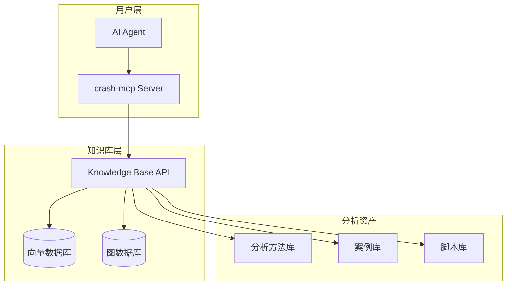
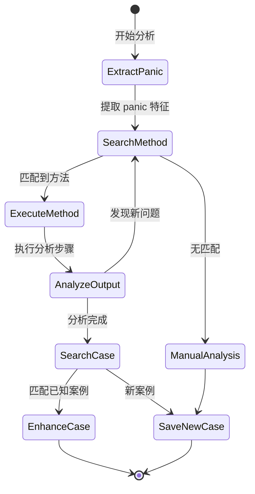

# Vmcore 分析知识库架构设计

## 1. 系统概述


```mermaid
graph TB
    subgraph "用户层"
        AI[AI Agent]
        MCP[crash-mcp Server]
    end
    
    subgraph "知识库层"
        KB[Knowledge Base API]
        VDB[(向量数据库)]
        GRAPH[(图数据库)]
    end
    
    subgraph "分析资产"
        METHODS[分析方法库]
        CASES[案例库]
        SCRIPTS[脚本库]
    end
    
    AI --> MCP
    MCP --> KB
    KB --> VDB
    KB --> GRAPH
    KB --> METHODS
    KB --> CASES
    KB --> SCRIPTS
```

## 2. 核心数据模型

### 2.1 分析方法 (AnalysisMethod)

```yaml
AnalysisMethod:
  id: string                    # 唯一标识
  name: string                  # 名称 (e.g., "hung_task_analysis")
  triggers:                     # 触发条件
    - pattern: "hung_task_check"
    - pattern: "INFO: task .* blocked"
  description: string           # 方法描述
  steps:                        # 分析步骤
    - command: "crash:ps -m"
      purpose: "查看任务状态"
    - command: "crash:bt <pid>"
      purpose: "查看阻塞堆栈"
  outputs:                      # 预期输出
    - name: "blocked_task"
    - name: "wait_channel"
  next_methods:                 # 可能的后续方法
    - condition: "rwsem detected"
      method_id: "rwsem_analysis"
    - condition: "mutex detected"
      method_id: "mutex_analysis"
  tags: [hung_task, scheduling]
```

### 2.2 分析案例 (AnalysisCase)

```yaml
AnalysisCase:
  id: string
  title: string                 # 案例标题
  panic_signature: string       # panic 特征签名
  kernel_version: string        # 内核版本
  root_cause: string            # 根因
  analysis_trace:               # 分析轨迹 (有序步骤)
    - step_id: 1
      method_id: "hung_task_analysis"
      findings: "发现 task A 阻塞在 rwsem"
      next_step: 2
    - step_id: 2
      method_id: "rwsem_analysis"
      findings: "rwsem 持有者为 task B"
      next_step: 3
  solution: string              # 解决方案
  confidence: float             # 置信度
  hit_count: int                # 命中次数
```

### 2.3 分析步骤 (AnalysisStep) - 子问题拆分

```yaml
AnalysisStep:
  id: string
  case_id: string               # 所属案例
  order: int                    # 步骤顺序
  question: string              # 子问题 (e.g., "谁持有这个 rwsem?")
  method_id: string             # 使用的方法
  input_context:                # 输入上下文
    - key: "rwsem_addr"
      value: "0xffff..."
  output_findings: string       # 发现
  child_steps: [string]         # 子步骤 ID 列表
```

## 3. 知识检索策略

### 3.1 多级匹配

```
Level 1: Panic 特征匹配 (精确)
    ↓ 无匹配
Level 2: 语义相似度检索 (向量)
    ↓ 无匹配
Level 3: 关键词 + 标签检索
    ↓ 无匹配
Level 4: 通用分析方法
```

### 3.2 向量化方案

| 内容 | 向量化策略 |
|------|-----------|
| Panic 信息 | 提取函数名 + 错误类型，嵌入 |
| 分析方法描述 | 直接嵌入 |
| 案例标题/根因 | 直接嵌入 |

## 4. 工作流引擎


```mermaid
stateDiagram-v2
    [*] --> ExtractPanic: 开始分析
    ExtractPanic --> SearchMethod: 提取 panic 特征
    SearchMethod --> ExecuteMethod: 匹配到方法
    SearchMethod --> ManualAnalysis: 无匹配
    ExecuteMethod --> AnalyzeOutput: 执行分析步骤
    AnalyzeOutput --> SearchMethod: 发现新问题
    AnalyzeOutput --> SearchCase: 分析完成
    SearchCase --> EnhanceCase: 匹配已知案例
    SearchCase --> SaveNewCase: 新案例
    EnhanceCase --> [*]
    SaveNewCase --> [*]
    ManualAnalysis --> SaveNewCase
```

## 5. 存储方案选型

| 组件 | 推荐方案 | 备选 | 理由 |
|------|---------|------|------|
| 向量数据库 | ChromaDB | Milvus, Qdrant | 轻量、易嵌入、支持持久化 |
| 元数据存储 | SQLite | PostgreSQL | 简单、无依赖 |
| 图关系 | SQLite + JSON | Neo4j | 关系简单，无需专业图库 |
| 脚本存储 | 文件系统 | Git | 版本控制、易于编辑 |

## 6. 目录结构

```
crash-mcp/
├── src/crash_mcp/
│   ├── kb/                     # 知识库模块
│   │   ├── __init__.py
│   │   ├── models.py           # 数据模型
│   │   ├── retriever.py        # 检索器
│   │   ├── vectorstore.py      # 向量存储
│   │   └── workflow.py         # 工作流引擎
│   └── server.py
├── knowledge/                  # 知识资产
│   ├── methods/                # 分析方法 (YAML)
│   │   ├── hung_task.yaml
│   │   ├── rwsem.yaml
│   │   └── mutex.yaml
│   ├── scripts/                # 分析脚本
│   │   ├── drgn/
│   │   └── crash/
│   └── cases/                  # 案例库 (自动生成)
└── data/
    ├── chroma/                 # 向量数据库
    └── kb.db                   # SQLite 元数据
```

## 7. 新增 MCP 工具

| 工具 | 说明 |
|------|------|
| `kb_search_method` | 根据 panic 特征检索分析方法 |
| `kb_search_case` | 检索相似案例 |
| `kb_save_case` | 保存/增强案例 |
| `kb_run_workflow` | 执行分析工作流 |

## 8. 技术依赖

```toml
# pyproject.toml 新增
dependencies = [
    "chromadb",           # 向量数据库
    "sentence-transformers",  # 嵌入模型
    "pyyaml",             # YAML 解析
]
```
