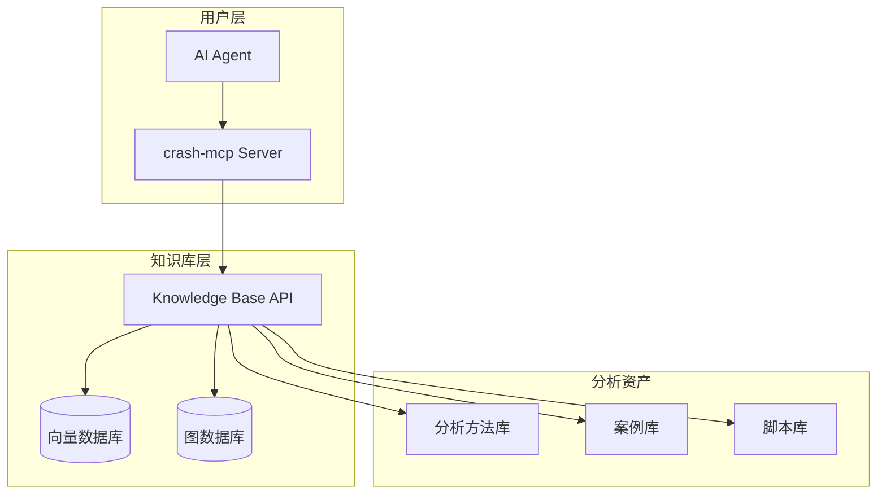
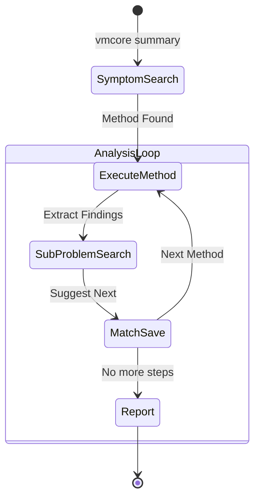

# Vmcore 分析知识库架构设计

## 1. 系统概述


```mermaid
graph TB
    subgraph "用户层"
        AI[AI Agent]
        MCP[crash-mcp Server]
    end
    
    subgraph "知识库层"
        KB[Knowledge Base API]
        VDB[(向量数据库)]
        GRAPH[(图数据库)]
    end
    
    subgraph "分析资产"
        METHODS[分析方法库]
        CASES[案例库]
        SCRIPTS[脚本库]
    end
    
    AI --> MCP
    MCP --> KB
    KB --> VDB
    KB --> GRAPH
    KB --> METHODS
    KB --> CASES
    KB --> SCRIPTS
```

## 2. 核心数据模型

### 2.1 分析方法 (AnalysisMethod)

```yaml
AnalysisMethod:
  id: string                    # 唯一标识
  name: string                  # 名称 (e.g., "hung_task_analysis")
  triggers:                     # 触发条件
    - pattern: "hung_task_check"
    - pattern: "INFO: task .* blocked"
  description: string           # 方法描述
  steps:                        # 分析步骤
    - command: "crash:ps -m"
      purpose: "查看任务状态"
    - command: "crash:bt <pid>"
      purpose: "查看阻塞堆栈"
  outputs:                      # 预期输出
    - name: "blocked_task"
    - name: "wait_channel"
  next_methods:                 # 可能的后续方法
    - condition: "rwsem detected"
      method_id: "rwsem_analysis"
    - condition: "mutex detected"
      method_id: "mutex_analysis"
  tags: [hung_task, scheduling]
```

### 2.2 分析案例 (AnalysisCase)

```yaml
AnalysisCase:
  id: string
  title: string                 # 案例标题
  panic_signature: string       # panic 特征签名
  kernel_version: string        # 内核版本
  root_cause: string            # 根因
  analysis_trace:               # 分析轨迹 (有序步骤)
    - step_id: 1
      method_id: "hung_task_analysis"
      findings: "发现 task A 阻塞在 rwsem"
      next_step: 2
    - step_id: 2
      method_id: "rwsem_analysis"
      findings: "rwsem 持有者为 task B"
      next_step: 3
  solution: string              # 解决方案
  confidence: float             # 置信度
  hit_count: int                # 命中次数
```

### 2.3 分析步骤 (AnalysisStep) - 子问题拆分

```yaml
AnalysisStep:
  id: string
  case_id: string               # 所属案例
  order: int                    # 步骤顺序
  question: string              # 子问题 (e.g., "谁持有这个 rwsem?")
  method_id: string             # 使用的方法
  input_context:                # 输入上下文
    - key: "rwsem_addr"
      value: "0xffff..."
  output_findings: string       # 发现
  child_steps: [string]         # 子步骤 ID 列表
```

## 3. 知识检索策略

### 3.1 多级匹配

```
Level 1: Panic 特征匹配 (精确)
    ↓ 无匹配
Level 2: 语义相似度检索 (向量)
    ↓ 无匹配
Level 3: 关键词 + 标签检索
    ↓ 无匹配
Level 4: 通用分析方法
```

### 3.2 向量化方案

| 内容 | 向量化策略 |
|------|-----------|
| Panic 信息 | 提取函数名 + 错误类型，嵌入 |
| 分析方法描述 | 直接嵌入 |
| 案例标题/根因 | 直接嵌入 |

## 4. LLM Agent 驱动设计

Agent 采用 **LLM 原生状态管理**，通过调用原子化 KB 工具实现分析循环。服务端不维护复杂状态机。

### 4.1 核心状态流

1.  **Symptom Retrieval (特征检索)**
    *   **Input**: `vmcore` 摘要 / Panic 字符串
    *   **Action**: 调用 `kb_search_symptom(query="hung task")`
    *   **Output**: 匹配的分析方法列表 (Method ID) 和初始置信度。

2.  **Execution & Extraction (执行与提取)**
    *   **Input**: `Method ID`
    *   **Action**: 调用 `analyze_method(method_id)` 封装工具。
        *   自动执行 YAML 定义的 `crash/drgn` 命令。
        *   提取关键指标 (e.g., `rwsem_addr`, `pid`)。
        *   保存临时上下文 (Context)。
    *   **Output**: 结构化分析结果 (Findings)。

3.  **Sub-problem Chain (子问题链检索)**
    *   **Input**: 上一步的 Findings (上下文)
    *   **Action**: 调用 `kb_search_subproblem(query="rwsem_blocked", context={"addr": "0xf123"})`。
    *   **Logic**: 自动拆分复杂问题，例如从 "Hung Task" -> "RWSEM Blocked" -> "Disk I/O Wait"。
    *   **Output**: 下一步的方法建议 (Next Method)。

4.  **Case Matching & Enhancement (案例匹配与增强)**
    *   **Input**: 当前累积的分析链路 (Chain) + 节点指纹
    *   **Action**: 调用 `kb_match_or_save_node(fingerprint, chain_data)`。
    *   **Logic**:
        *   **Similarity > 0.8**: 判定为已知案例，执行 **Merge Evidence** (合并证据，增加权重)。
        *   **Otherwise**: 判定为新发现，执行 **New Node Creation** ，生成新指纹。
    *   **Output**: 案例节点引用 (Node Ref)。

5.  **Reporting (报告输出)**
    *   **Output**: 完整分析链路报告 + 引用知识库节点 ID。

### 4.2 Agent 工具集 API

| 工具名 | 参数 | 描述 |
|---|---|---|
| `kb_recommend_method` | `query`: string | [L1] 输入症状，推荐分析协议。 |
| `kb_get_method_guide` | `method_id`: string | [L2] 获取标准分析方法的详细步骤指南。 |
| `kb_match_pattern` | `query`: string, `context`: dict | [L3] 匹配历史发现/模式。 |
| `kb_save_pending` | `asset_type`, `name`, `content` | [Write] 保存新资产到待审核区。 |
| `kb_quick_start` | `panic_text`: string | [Workflow] 快速启动：自动执行搜索并返回首个方法。 |


```mermaid
stateDiagram-v2
    [*] --> SymptomSearch: vmcore summary
    SymptomSearch --> ExecuteMethod: Method Found
    
    state AnalysisLoop {
        ExecuteMethod --> SubProblemSearch: Extract Findings
        SubProblemSearch --> MatchSave: Suggest Next
        MatchSave --> ExecuteMethod: Next Method
        MatchSave --> Report: No more steps
    }
    
    Report --> [*]
```

## 5. 存储方案选型

| 组件 | 推荐方案 | 备选 | 理由 |
|------|---------|------|------|
| 向量数据库 | ChromaDB | Milvus, Qdrant | 轻量、易嵌入、支持持久化 |
| 元数据存储 | SQLite | PostgreSQL | 简单、无依赖 |
| 图关系 | SQLite + JSON | Neo4j | 关系简单，无需专业图库 |
| 脚本存储 | 文件系统 | Git | 版本控制、易于编辑 |

## 6. 目录结构

```
crash-mcp/
├── src/crash_mcp/
│   ├── kb/                     # 知识库模块
│   │   ├── __init__.py
│   │   ├── models.py           # 数据模型 (CaseNode, AnalysisMethod)
│   │   ├── layered_retriever.py # 统一检索器 (L1/L2/L3)
│   │   ├── simple_retriever.py # [已废弃] 简单检索器
│   │   ├── case_manager.py     # 案例持久化
│   │   └── workflow.py         # 快速启动辅助函数
│   ├── config.py               # 配置 (阈值、模型)
│   └── server.py
├── knowledge/                  # 知识资产
│   ├── methods/                # 分析方法 (YAML)
│   └── cases/                  # 案例库 (JSON)
└── data/
    └── chroma/                 # 向量数据库
```

## 7. 新增 MCP 工具

| 工具 | 说明 |
|------|------|
| `kb_recommend_method` | L1 症状推荐分析方法 |
| `kb_get_method_guide` | L2 获取方法详情/步骤 |
| `kb_match_pattern` | L3 匹配历史发现/模式 |
| `kb_save_pending` | [Write] 保存资产到待审核区 |
| `kb_quick_start` | [Workflow] 快速启动辅助工具 |
| `kb_list_scripts` | 列出可用脚本 |
| `kb_get_script` | 获取脚本详情 |

## 8. 配置项

| 环境变量 | 默认值 | 说明 |
|----------|--------|------|
| `KB_BASE_DIR` | `""` (项目根目录) | 知识库/数据根目录 |
| `KB_SIMILARITY_THRESHOLD` | `0.2` | 向量匹配阈值 (距离) |
| `KB_EMBEDDING_MODEL` | `all-MiniLM-L6-v2` | 嵌入模型名称 |

## 8. 技术依赖

```toml
# pyproject.toml 新增
dependencies = [
    "chromadb",           # 向量数据库
    "sentence-transformers",  # 嵌入模型
    "pyyaml",             # YAML 解析
]
```
