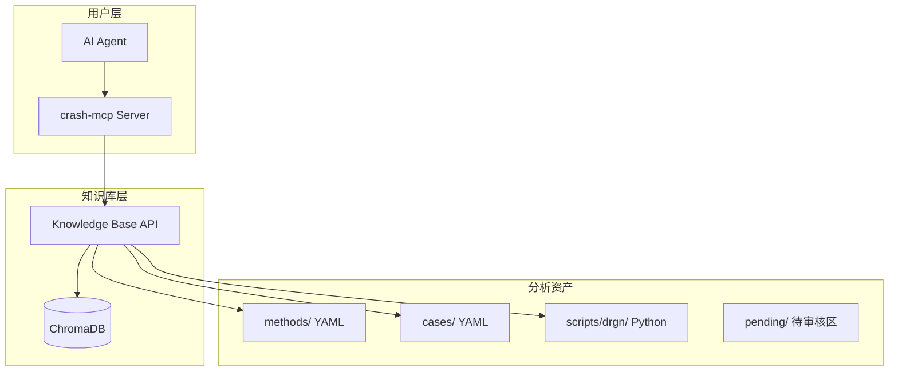
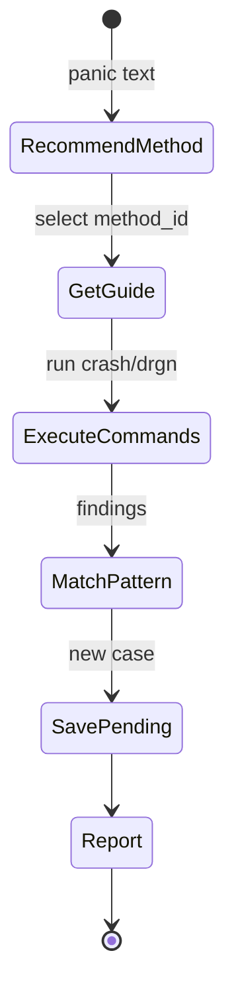

# 当前架构设计

> 本文档描述 crash-mcp 的**当前实现状态**，与 `architecture_design.md` (理想架构) 相对应。

## 1. 系统概述



**与理想架构的差异**:
- 无图数据库 (暂不需要)
- 无子问题树 (LLM 原生能力已覆盖)

---

## 2. 数据模型

### 2.1 分析方法 (knowledge/methods/*.yaml)

```yaml
id: hung_task_analysis
name: Hung Task Analysis
description: 分析 D 状态任务
triggers:
  - pattern: "hung_task"
  - pattern: "blocked for more than"
steps:
  - command: "crash:ps -m"
    purpose: "查看任务状态"
  - command: "drgn:hung_task.py"
    purpose: "运行分析脚本"
outputs:
  - name: blocked_task
  - name: wait_channel
tags: [hung_task, scheduling]
```

### 2.2 案例 (knowledge/cases/*.yaml)

```yaml
id: example_case
name: Example Case
panic_signature: ""
kernel_version: ""
root_cause: |
  根因描述
analysis_trace:
  - step_id: 1
    method_id: ""
    findings: ""
solution: |
  解决方案
confidence: high
tags: []
```

---

## 3. MCP 工具集

### 会话管理 (6个)

| 工具 | 用途 |
|:---|:---|
| `list_crash_dumps` | 扫描 vmcore 文件 |
| `start_session` | 启动分析会话 |
| `stop_session` | 关闭会话 |
| `run_crash_command` | 执行 crash 命令 |
| `run_drgn_command` | 执行 drgn 代码/脚本 |
| `get_sys_info` | 获取系统信息 |

### 知识库 (7个)

| 工具 | 用途 |
|:---|:---|
| `kb_recommend_method` | [L1] 输入症状，推荐分析协议 |
| `kb_get_method_guide` | [L2] 获取具体的分析步骤指南 |
| `kb_match_pattern` | [L3] 匹配历史发现/模式 |
| `kb_quick_start` | [Workflow] 快速启动 |
| `kb_save_pending` | [Write] 保存资产到待审核区 |
| `kb_list_scripts` | 列出辅助分析脚本 |
| `kb_get_script` | 获取脚本详情 |

---

## 4. 目录结构

```
crash-mcp/
├── src/crash_mcp/
│   ├── kb/                     # 知识库模块
│   │   ├── models.py           # 数据模型
│   │   ├── layered_retriever.py # L1/L2/L3 检索器
│   │   └── workflow.py         # 快速启动
│   ├── tools/
│   │   ├── kb_tools.py         # KB 工具
│   │   └── session_mgmt.py     # Session 工具
│   ├── prompts.py              # System Prompt
│   └── server.py               # MCP Server
├── knowledge/                  # 知识资产
│   ├── methods/                # 分析方法 (YAML)
│   ├── cases/                  # 案例库 (YAML)
│   ├── scripts/drgn/           # drgn 脚本
│   └── pending/                # 待审核区
│       ├── methods/
│       ├── cases/
│       └── scripts/
└── data/
    └── chroma/                 # 向量数据库
```

---

## 5. 检索机制

```
L1: kb_recommend_method(query)
    ├── 关键词触发匹配 (triggers)
    └── 语义向量搜索 (ChromaDB methods 集合)
    
L2: kb_get_method_guide(method_id)
    └── 从 YAML 文件加载 steps/outputs
    
L3: kb_match_pattern(query, context)
    └── 语义向量搜索 (ChromaDB case_nodes 集合)
```

---

## 6. 工作流



---

## 7. 配置项

| 环境变量 | 默认值 | 说明 |
|----------|--------|------|
| `KB_BASE_DIR` | `""` (项目根目录) | 知识库根目录 |
| `KB_SIMILARITY_THRESHOLD` | `0.2` | 向量匹配阈值 |
| `KB_EMBEDDING_MODEL` | `all-MiniLM-L6-v2` | 嵌入模型 |
| `CRASH_SEARCH_PATH` | `/var/crash` | vmcore 搜索路径 |
| `LOG_LEVEL` | `INFO` | 日志级别 |
